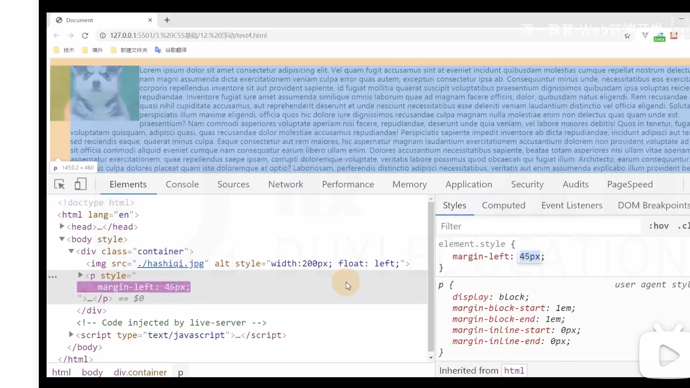

# 浮动

## 浮动的基本特点

1. 浮动的元素一定是块盒 display: block;
   当一个元素浮动后，该元素必定为块盒。

2. 浮动元素的包含块，和常规流一样，为父元素的内容盒.

## 盒子尺寸

1. 宽度为 auto 时，适应内容宽度。没有要求一定要撑满。 常规流会吸收剩余空间。
2. 高度为 auto 时，与常规流一致，适应内容的高度。
3. margin 为 auto,为 0。
4. 边框，内边距，百分比设置与常规流一样。都是包含块的宽度的百分比
5. **行盒在排列时，会避开浮动盒子**
6. 外边距合并在浮动盒子里不会发生。 脱离了常规流

## 盒子排列

1. 浮动盒子在包含块中排列时，前面有常规流块盒， 会避开常规流块盒。（这里常规流块盒先出现）
2. 后面有常规流块盒，无视他, 直接浮动在后面块盒的头上。
   常规流块盒在排列时，无视浮动盒子。（这里常规流块盒后出现） 就跟浮动盒子不存在一样。
   **大白话: 如果浮动盒子排列的时候，前面已经有常规流了，避开他
   如果常规流排列之前，前面已经有浮动了，忽略他**

## 浮动

### 文字环绕

**1.首先 ！行盒,行盒,行盒！ 在排列时，会避开浮动盒子**

案例就是文字环绕 img 和 p 元素的案例
在给 img 添加 float 后，p 元素覆盖了一整块面积，按理说，文字应该会顶格排放。
只有行盒才会避开浮动元素。但是我们写的 p 元素是一个块盒，它凭什么要避开浮动元素呢?
是因为
**如果文字没有在行盒中，浏览器会自动生成一个行盒包裹文字，该行盒叫做匿名行盒。**

such as: 要说的就是文字环绕。
一个 img 元素， 一个 p 元素。给 img 加了浮动后，文字就环绕了。
可以想象成 `
`我需要环绕的文字`
` 这是浏览器自动生成的

但是，文字和图片挨的太近了，给 p 元素添加 margin-left 的话，因为 p 元素是完全**无视浮动元素的**，
那么加 margin-left 的时候，是会从最左侧开始 有间距

图中的狗占用的这一块空间，p 元素中还是存在的。只是文字内容的匿名行盒避开了它。

浮动元素排列，

案例里如果想要 图片与文字有间隙，则应该给图片加 margin
因为直接给文字加 margin，案例里 p 元素是常规流，块级，
**是完全无视浮动元素的**。
加的 margin 直接就让整体内容开始缩小

所以需要对 img 添加 margin

## 高度坍塌

原因： 常规流盒子的自动高度，是适应内容。但是在计算时，不会考虑浮动盒子. 忽略掉
回答：浮动盒子脱离了常规流

### 解除：

清除浮动（**不是不浮动**）：css 属性为 clear

- clear 元素 默认为 none

取值为:

- left 清除左浮动，该元素必须出现在前面所有左浮动盒子的下方。
- right 清除右浮动，该元素必须出现在前面所有右浮动盒子的下方。
- both: 清楚左右浮动，该元素必须出现在前面所以浮动盒子的下方

**clear 清除浮动，该元素必须出现在前面所有浮动盒子的下方。**

    一种方式，直接加个div
    然后该div的样式为clear:both

    如果不想要多加div元素，觉得多余，那就对外层坍塌的了容器
    添加 一个属性
    .clearfix::after
    属性设置为：{
        content:'';
        display:block;
        clear:both;
    }

    一定要加display:block;  因为默认是display:inline
