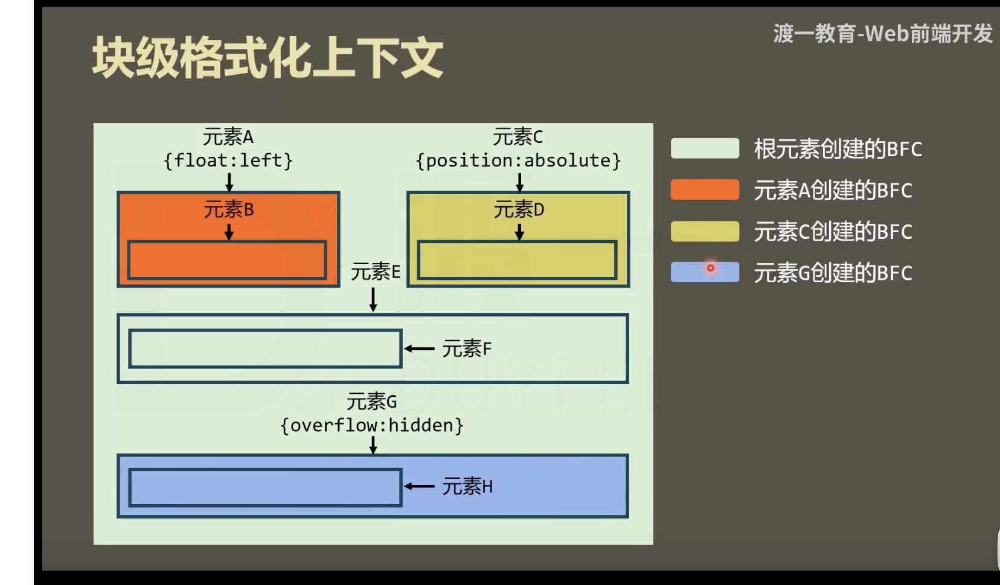

# BFC

Block Formatting text 块级格式化上下文

它是一块渲染区域，它规定了在该区域中，常规流块盒的布局

复习一下 块盒

1.常规流块盒在水平方向上，一定要撑满 包含块
2.在垂直方向上排列
3.相邻的块盒会发生外边距合并     （若外边距无缝连接，则进行外边距合并
4.渲染的时候  自动高度和摆放位置，无视浮动元素

## 它的自动高度需要计算浮动元素 

解决高度坍塌的问题

## 边框盒 不会与浮动元素重叠

BFC会自动隔开浮动的元素

## 不会与它的子元素进行外边距合并

不同BFC的盒子不会出现边距合并

