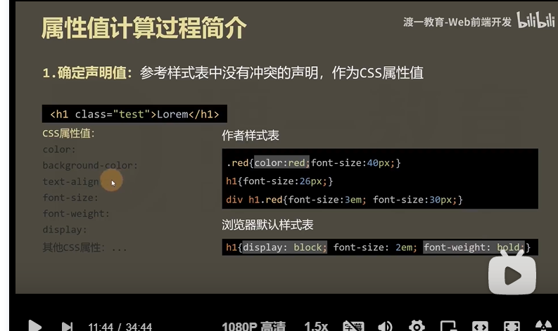
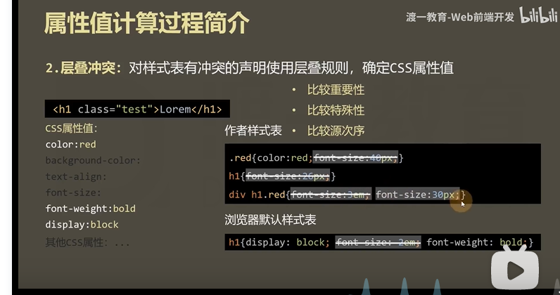
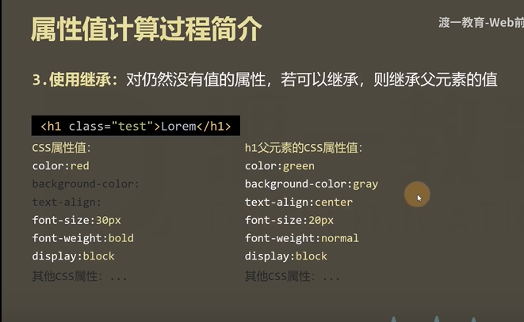

# 属性值的计算过程

保存图片

<!--  -->

渲染每个元素的前提条件: 该元素的所有css属性必须有值。

一个元素: 从所有属性都没有值，到所有属性都有值，这个计算过程，叫做属性值计算过程。

# 确定声明值

老师：参考样式表中没有冲突的声明，作为css属性值

没有冲突的属性，直接赋值

# 层叠冲突

老师: 对样式表有冲突的声明使用层叠规则，确定CSS属性值

有冲突的属性，则进行层叠
根据 重要性 特殊性 源次序

# 使用继承

没有冲突的，可以继承的则进行继承

# 使用默认值

对仍然没有值的属性，使用默认值

特殊的两个CSS取值:
- inherit： 手动(强制)基础，将父元素的值取出应用到该元素。
  （相当于将第三步提前了）

- initial： 初始值，将该数字设置为默认值。
    恢复元素的默认值

最终保留的是 font-size:30px;

比较重要性，所以先筛去默认样式表的font-size:2em;
即 图里的最后一个

比较特殊性，再筛去 font-size:40px;   font-size:26px
即 图里的一二 

然后再源次序，将font-size:3em筛去

