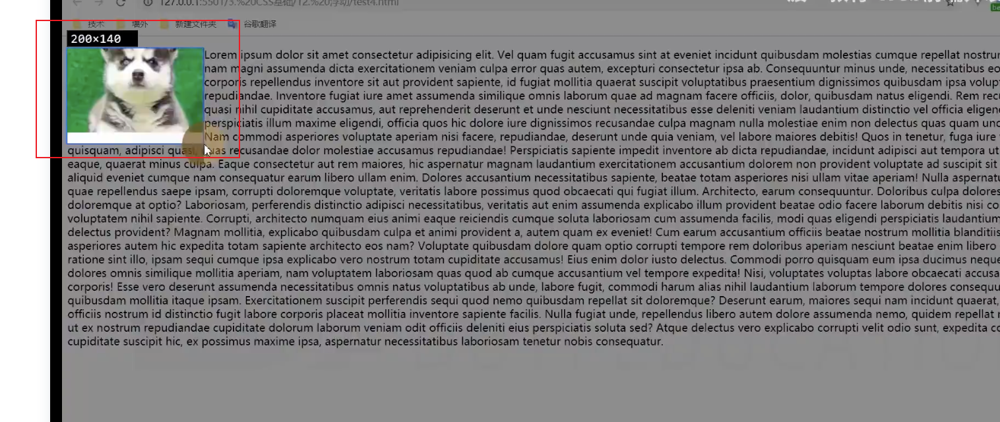
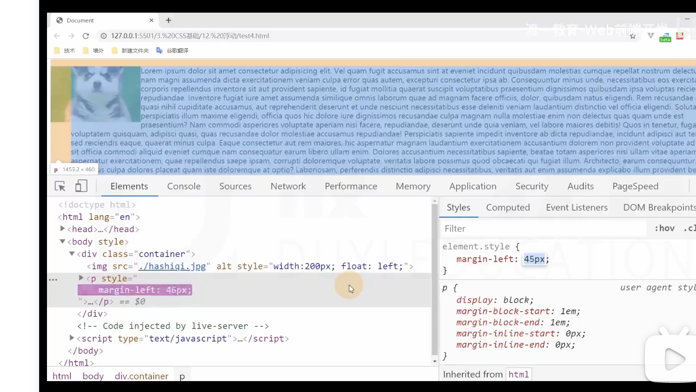

# 浮动

## 浮动的基本特点

## 盒子尺寸

1. 宽度为auto时，适应内容宽度
2. 高度为auto时，与常规流一致，适应内容的高度
3. margin为auto,为0
4. 边框，内边距，百分比设置与常规流一样。都是包含块的宽度的百分比
5. **行盒在排列时，会避开浮动盒子**
6. 外边距合并在浮动盒子里不会发生。

## 盒子排列

浮动盒子在包含块中排列时，会避开常规流块盒
常规流块盒在排列时，无视浮动盒子

**大白话: 如果浮动盒子排列的时候，前面已经有常规流了，避开他  
       如果常规流排列之前，前面已经有浮动了，忽略他**

**行盒在排列时，会避开浮动盒子**

**如果文字没有在行盒中，浏览器会自动生成一个行盒包裹文字，该行盒叫做匿名行盒。**

such as: 要说的就是文字环绕。
    一个img元素， 一个p元素。给img加了浮动后，文字就环绕了。
    可以想象成 
我需要环绕的文字
 这是浏览器自动生成的

图中的狗占用的这一块空间，p元素中还是存在的。只是文字内容的匿名行盒避开了它。

    

浮动元素排列，

## 文字环绕

案例里如果想要 图片与文字有间隙，则应该给图片加margin
因为直接给文字加margin，案例里p元素是常规流，块级，
**是完全无视浮动元素的**。
加的margin直接就让整体内容开始缩小

所以需要对img添加margin

## 高度坍塌

原因： 常规流盒子的自动高度，在计算时，不会考虑浮动盒子.

清除浮动：css

clear元素 默认为none

取值为: 
    left 清除左浮动，该元素必须出现在前面所有左浮动盒子的下方。
    right 清除右浮动，该元素必须出现在前面所有右浮动盒子的下方。

  **clear 清除浮动，该元素必须出现在前面所有浮动盒子的下方。**

    一种方式，直接加个div
    然后该div的样式为clear:both
    
    如果不想要多加div元素，觉得多余，那就对外层坍塌的了容器
    添加 一个属性
    .clearfix::after 
    属性设置为：{
        content:'';
        display:block;
        clear:both;
    }

    一定要加display:block;  因为默认是display:inline

    
